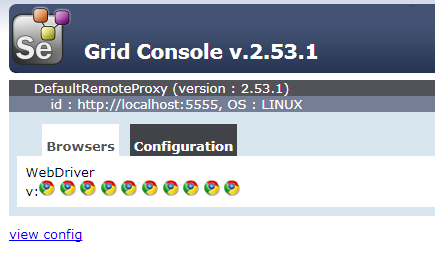

# VagrantSeleniumGrid

Vagrant configuration base on ubuntu/trusty64, ready to be used with Selenium Grid.

## Introduction

Based on [vagrant-selenium](https://github.com/Anomen/vagrant-selenium)
Selenium allows you to automate tests in Web Browsers. To do so, you need to have selenium webdriver installed for all the browsers that you want to run your test into.

## Installation

1. Install [Vagrant](https://www.vagrantup.com)
2. Clone this git repository
3. Modify `Configuration for Hub` (start on line 56)
4. Change `host` (line 57) and `maxSessions` (line 58)
5. Run the command `vagrant up`

This vagrant works for *Virtualbox*, on a 64 bits machine.

## Browser support

- Google Chrome (latest version)

The script also installs the latest version of selenium server, and google chrome webdriver.

## Why a VM for Selenium?

Installing selenium server and the webdrivers are easy on a machine. However, everytime that you want to run your tests, it opens the browser on top of the other windows, preventing you from doing something else. Unless you use phantomjs, it is not possible to run Chrome or Firefox hidden, without disturbing you on your work.

Thanks to this VM, you only need to start the VM, and all your tests will be run into the VM. You can continue developping in the meanwhile!

## How to check Selenium Grid status?

http://host:4444/grid/console

`host` from 4 step or using localhost
